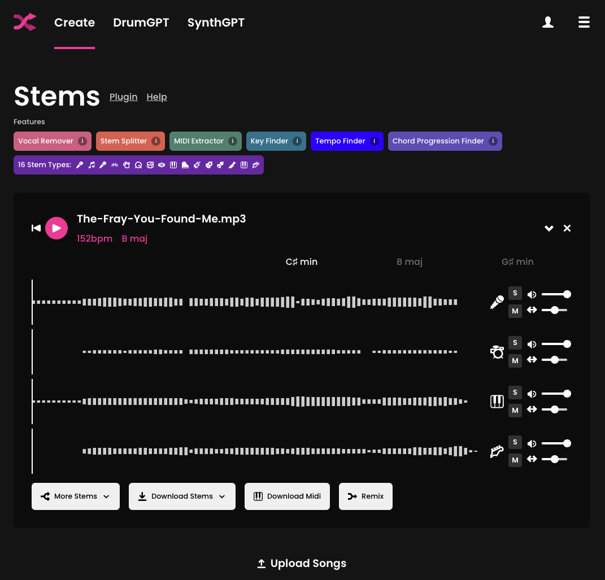
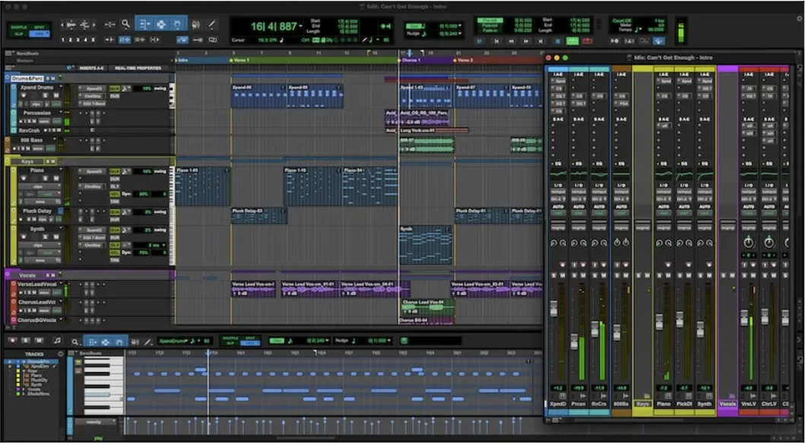

# Generative AI Mashup: "You Found Me" × "Californication"

**Author**: Dassie Galapo  

## Project Overview

This is a generative AI audio remix that combines two iconic songs:
- **Instrumental Base**: *You Found Me* – The Fray  
- **Vocal Layer**: *Californication* – Red Hot Chili Peppers

The goal: create a smooth, emotionally resonant mashup using AI-assisted tools that isolate and blend stems for a seamless fusion of voice and instrument.

## Tools & Technologies

- [Fadr.com](https://fadr.com/stems) — AI-based stem separation
- Pro Tools — for pitch/time adjustment and final mixing
- SongKeyFinder — for key/BPM alignment
- Elastic Audio (Pro Tools) — for pitch correction and tempo syncing

## Why This Project?

As someone passionate about both music and technology, this project allowed me to explore:
- Creative AI in audio engineering
- Practical music theory applications
- Real-world remixing workflows
- Technical toolchains used in music production

This was part of my journey toward a **Music Technology Certificate**, and reflects my ongoing interest in generative creativity.

## Audio Files 
*Note: You may need to download since the files may be too large*

- [`Mashup Test.wav`](mashup-assets/Mashup_Test.wav) — Full AI-enhanced mashup  
- [`Mashup Test_1.wav`](mashup-assets/Mashup_Test_1.wav) — A focused snippet highlighting the smooth transition between songs

## Workflow Summary

1. **Song Selection**  
   - Chose two tracks with emotional and tonal resonance  
   - Checked key and BPM using [songkeyfinder.com](https://songkeyfinder.com)

2. **Stem Separation**  
   - Uploaded MP3s to Fadr.com  
   - Extracted vocal and instrumental stems  
   - Documented key and BPM

3. **DAW Processing** (Pro Tools)
   - Imported stems
   - Pitch shifted instrumentals to match vocals using Elastic Audio
   - Cropped to the first beat with tap-to-transient
   - Aligned tempos by converting tracks to "tick"-based and matching BPM

4. **Final Mixing & Export**
   - Balanced audio levels
   - Exported full mix and snippet highlight

## What's Next?

This project inspired me to explore more:
- AI-assisted remix generation with multi-song transitions
- Building a full remixing pipeline in Python with API integrations
- Real-time generative remixing with MIDI inputs

---

## Screenshots 

### AI Tool in Action: Fadr Stem Separation

Below is a screenshot of [Fadr.com](https://fadr.com/stems) separating *"You Found Me"* by The Fray into instrumental and vocal stems. This was the foundation for aligning keys, isolating parts, and crafting the mashup.

*Fadr’s AI stem separation enabled precise control over song structure and mood, empowering the generative remix process.*

### 🎛️ Screenshot of Pro Tools Intro

*Screenshot from MusicManta’s “Pro Tools Intro – New Free DAW” article (June 2023)*  

---

## Want to Try It Yourself?

Clone the repo, grab your own MP3s (for educational use only), and follow the replication steps in [this guide](docs/workflow.md).
